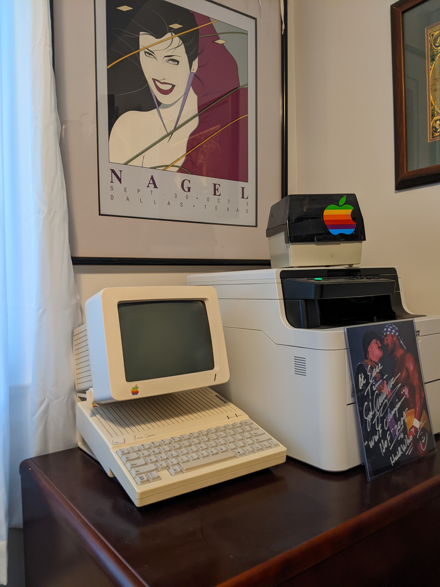



## What I do

I have been shipping code for well over two decades now, and I still really love my work.  Currently I am working as a
front-end heavy full-stack developer - being a huge fan of the [React][react] framework and having decades worth of
experience with the [.NET ecosystem][dn]. I have entirely embraced [TypeScript][ts] for anything I would normally have
written in JavaScript - such as a React front-end, [NodeJS][nodejs] middle tier code, or even [personal experiments][rnx]
with [React Native][rn]. Lately I have been focusing on automating my code quality through the use of good static
analysis tools like [ESLint][esl] and [Prettier][pret] paired with an extensive test suite - usually leveraging
[Kent C. Dodd's][kcd] excellent [Testing Library][testl] to enhance the [Jest][jest] testing framework
[(example)][mycrypto].

## How I got here



I was bitten by the programming bug after seeing the Disney movie [Tron][tron] as a young teenager - afterwards
ceaselessly bugging my parents until they gave in and purchased a top-of-the line Apple //c for me.
That computer introduced me to the world of Apple Basic and 6502 Assembler and still sits in a corner of my office
[(pic)]( "The original Apple //c").

After years of developing in mainframe languages and Visual Basic 6 I finally slid into web development with the first
release of ASP.NET. Fast forward a bit and I land at a startup as a "C# Cloud Developer", but since I proved to be really
handy with jQuery, HTML5 and this new-fangled thing called [Sass][sass] I was tasked with being the "front-end guy". I
very quickly learned that I loved the bleeding edge of 2013 front-end development - evaluating frameworks like early
[AngularJS][ng], [Backbone][bb], and [Knockout][ko] tooling like the [Grunt][grunt] and [Gulp][gulp] task runners and an
early bundler called [Almond][almond]. The rest, as they say, is history as the frameworks, tooling, and discipline of
front-end development have only grown more refined since then.

## Where I am

I live in Omaha, NE with my wife, daughter and three very random rescue dogs. Even though I am not wild about winters
here in the Midwest, I cannot seem to talk my wife into moving anywhere else so I am stuck here for the time being. In
my spare time I like experimenting with different programming languages and frameworks. When my family manages to get me
out of the house I enjoy walking our local [botanical gardens][laur], [world class zoo][hdz], or one of [our many][dur] -
[sometimes eclectic][shd] - [museums][jos].

## My Apple //c

[dn]: https://dotnet.microsoft.com/en-us/ "Microsoft's cross-platform development framework"
[react]: https://reactjs.org/ 'A component based JavaScript library for building user interfaces'
[rn]: https://reactnative.dev/ 'Create native apps for Android and iOS using React'
[rnx]: https://github.com/code-chimp/MealsToGoSimplified 'Workshopping TypeScript for React-Native development'
[ts]: https://www.typescriptlang.org/ 'A superset of modern JavaScript with type safety as a focus'
[esl]: https://eslint.org/ 'A pluggable linting utility for early identification of problems in your code'
[pret]: https://prettier.io/ 'An opinionated code formatter'
[jest]: https://jestjs.io/ 'JavaScript test framework'
[testl]: https://testing-library.com/ 'Utilities to aid in UI testing'
[kcd]: https://kentcdodds.com/ 'Educator, blogger, extreme sports enthusiast'
[nodejs]: https://nodejs.org/en/ 'Cross-platform JavaScript runtime environment'
[tron]: https://en.wikipedia.org/wiki/Tron '1982 sci-fi movies starring Jeff Bridges, Bruce Boxleitner, and Cindy Morgan'
[mycrypto]: https://github.com/code-chimp/cryptochain 'Personal exploration of blockchain concepts prototyped in NodeJS + React'
[hdz]: https://www.omahazoo.com/ "Omaha's Henry Doorly Zoo and Aquarium"
[laur]: https://lauritzengardens.org/ 'Lauritzen Gardens are a botanical gardens and arboretum located in Omaha, NE'
[dur]: https://durhammuseum.org/ "The Durham Museum. Making its home in one of Omaha's most unique treasures, Union Station"
[jos]: https://joslyn.org/ 'The Joslyn Art Museum is the principal fine arts museum in the state of Nebraska'
[shd]: https://www.museumofshadows.com/ 'Museum full of over 3000 verified Haunted Artifacts, Voted Worlds Most Haunted Museum'
[sass]: https://sass-lang.com/ 'Syntactically Awesome Style Sheets'
[bb]: https://backbonejs.org/ 'early framework to give structure to JavaScript heavy front-end applications'
[ko]: https://knockoutjs.com/ 'JavaScript MVVM library for dynamic UIs'
[ng]: https://angularjs.org/ 'a toolset for building the framework most suited to your application development'
[grunt]: https://gruntjs.com/ 'JavaScript task runner'
[gulp]: https://gulpjs.com/ 'JavaScript toolkit and task runner'
[almond]: https://github.com/requirejs/almond 'bundle javascript written with RequireJS'
