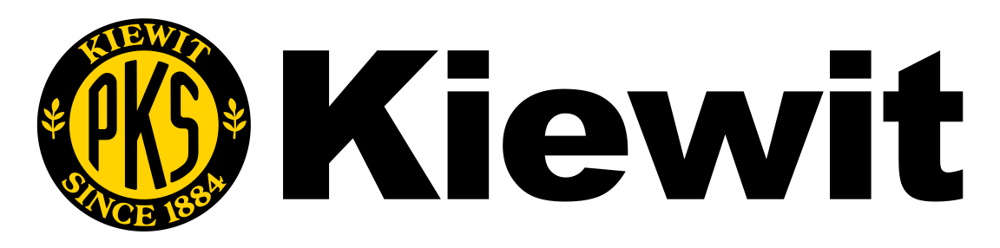

## Experience

<table>
  <thead>
    <tr>
      <th>Company</th>
      <th>Link</th>
      <th>Role</th>
      <th>Dates</th>
      <th>Location</th>
    </tr>
  </thead>
  <tbody>
    <tr>
      <td></td>
      <td><a href="https://helix.q2.com">Helix by Q2</a></td>
      <td>Staff Software Engineer</td>
      <td>06/2021 - Present</td>
      <td>Remote  Austin, TX USA</td>
    </tr>
    <tr>
      <td></td>td>
      <td><a href="https://www.kiewit.com">Kiewit Corporation</a></td>
      <td>Sr. Software Engineer</td>
      <td>05/2019 - 06/2021</td>
      <td>Omaha, NE USA</td>
    </tr>
    <tr>
      <td></td>
      <td><a href="https://orion.com/">Orion</a></td>
      <td>Software Engineer / API Developer </td>
      <td>11/2017 - 05/2019</td>
      <td>Omaha, NE USA</td>
    </tr>
    <tr>
      <td></td>
      <td><a href="https://www.medefis.com/">Medefis, Inc.</a></td>
      <td>Sr. Programmer </td>
      <td>06/2016 - 11/2017</td>
      <td>Omaha, NE USA</td>
    </tr>
    <tr>
      <td></td>
      <td><a href="https://www.csgi.com/">CSG International</a></td>
      <td>Sr. User Interface Development Engineer</td>
      <td>09/2015 - 06/2016</td>
      <td>Omaha, NE USA</td>
    </tr>
    <tr>
      <td></td>
      <td><a href="https://www.idea5inc.com/">idea5, Inc.</a></td>
      <td>Sr. Full-Stack Developer</td>
      <td>06/2013 - 09/2015</td>
      <td>Omaha, NE USA</td>
    </tr>
    <tr>
      <td></td>
      <td><a href="https://www.lineagelogistics.com/">Lineage Logistics</a></td>
      <td>Sr. Programmer Analyst</td>
      <td>05/2012 - 06/2013</td>
      <td>Omaha, NE USA</td>
    </tr>
    <tr>
      <td></td>
      <td><a href="https://www.streck.com/">Streck</a></td>
      <td>Sr. Programmer/Analyst</td>
      <td>07/2011 - 05/2012</td>
      <td>La Vista, NE USA</td>
    </tr>
    <tr>
      <td></td>
      <td><a href="https://inetsgi.com/">iNet Solutions Group, Inc.</a></td>
      <td>Sr. Developer</td>
      <td>08/2007 - 07/2011</td>
      <td>Omaha, NE USA</td>
    </tr>
    <tr>
      <td rowspan="3"></td>
      <td rowspan="3"><a href="https://www.sitel.com/">Sitel Group</a></td>
      <td>Web Developer 2006 - 2007</td>
      <td rowspan="3">05/1999 - 08/2007</td>
      <td rowspan="3">Omaha, NE USA</td>
    </tr>
    <tr>
      <td style="padding: 8px">Programmer III 2002 - 2006</td>
    </tr>
    <tr>
      <td style="padding: 8px">Programmer II 1999 - 2002</td>
    </tr>
  </tbody>
</table>

## Special Interest

| Company                                                                             | Link                                                 | Role               | Dates             | Location                     |
|-------------------------------------------------------------------------------------|------------------------------------------------------|--------------------|-------------------|------------------------------|
|  | [Lazarus Software](https://www.lazarussoftware.com/) | Technology Artisan | 05/2014 - Present | Remote Omaha, NE USA |

